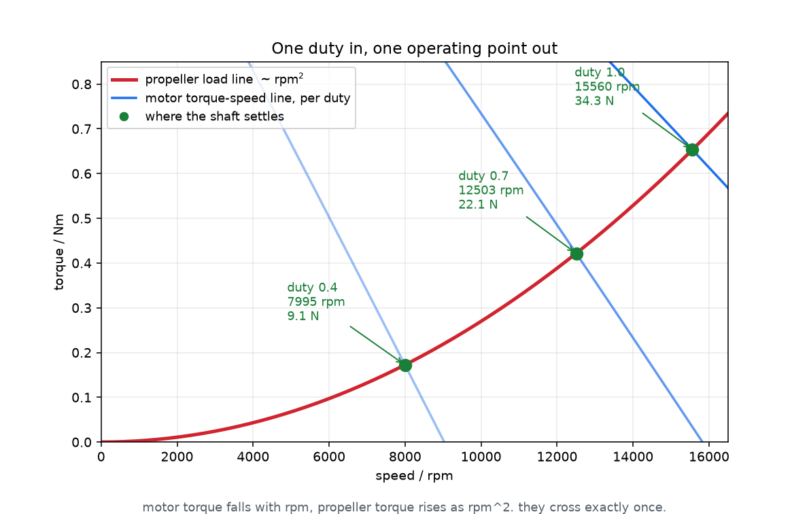
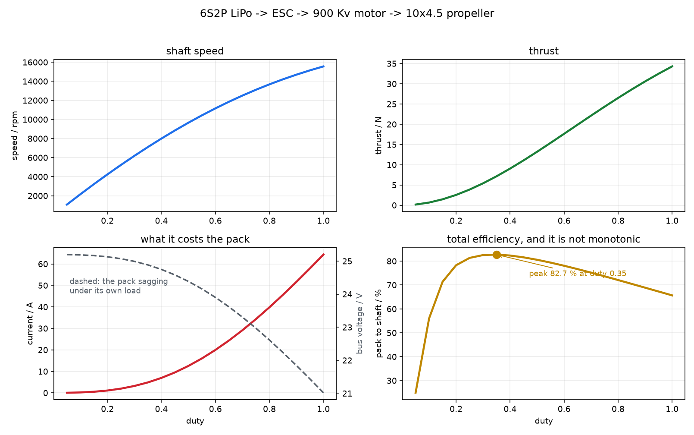
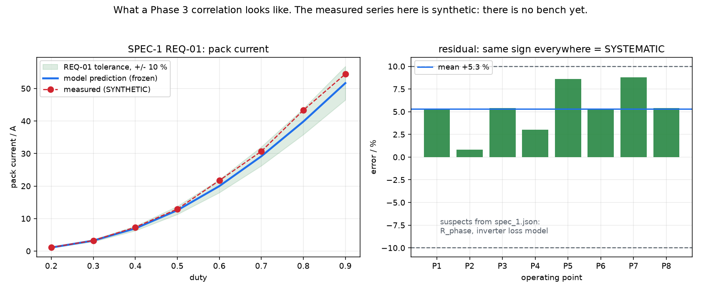

# AETHER

**Electric propulsion modelling, pre-sizing and hardware validation.**

Sibling framework to [GAIA](https://github.com/Alifizz01/GAIA). GAIA models the energy
source. AETHER models what it drives.

> In Greek cosmogony Gaia is the earth and Aether is the upper air. Same family,
> different element.

---

## What it does

You give it **one number**, the throttle. It returns the whole chain: where the shaft
settles, what the pack pays for it, and where every watt went.

```python
pt = Powertrain(pack, inverter, motor, propeller=prop)

pt.solve_loaded(duty=0.6)    # -> rpm, thrust, currents, losses, efficiency
pt.duty_for_thrust(8.0)      # -> the duty a perfect controller would hold
```

```
   PACK  -->  INVERTER  -->  MOTOR  -->  PROPELLER
   (DC)       (DC->AC)      (AC->Nm)     (load)
     ^                                       |
     +-------- POWERTRAIN solves the loop ---+
                        BMS watches
```

Nothing in that chain can be computed first. The pack sags by an amount that depends on
the current, the current depends on the voltage the motor sees, and the motor's speed
depends on how hard the propeller resists. `Powertrain` solves the circle.

---

## The core idea: one duty in, one operating point out



**Motor torque falls with rpm. Propeller torque rises as rpm².** They cross exactly once,
and that crossing is where the shaft actually settles. Move the throttle and the motor
line shifts; the crossing slides along the load line.

rpm is therefore not an input. It is an answer.

---

## What the chain does across the throttle range



```
 duty     rpm   thrust    i_dc    u_dc    pack->shaft
  0.2    4237    2.54 N   1.09 A  25.13 V    78.3 %
  0.4    7995    9.05 N   6.96 A  24.75 V    82.3 %
  0.6   11162   17.65 N  19.98 A  23.90 V    78.1 %
  0.8   13679   26.50 N  39.82 A  22.61 V    72.1 %
  1.0   15560   34.29 N  64.33 A  21.02 V    65.7 %
```

Two results worth noticing, neither of which was put in by hand:

**Efficiency peaks at 82.7 % near duty 0.35 and falls off both ways.** Low throttle wastes
on switching and no-load drag; high throttle wastes on `I²R` and on pack sag. The peak is
an output of the model, not an assumption in it.

**The bus collapses from 25.1 V to 21.0 V** across the sweep. That sag is what eventually
ends a flight: when even full duty cannot hold the required thrust, `duty_for_thrust`
raises `ThrustUnreachable`. That is not a solver failure, it is the controller running out
of adjustment.

---

## How it will be proved against hardware



> The measured series in that figure is **synthetic**. It shows the shape a Phase 3 report
> will take, not a result from hardware.

The whole loop already runs end to end against a **virtual bench**: `aether/hardware/`
provides a `BenchInterface`, a `VirtualBench` that answers like a real rig, and a socket
client and server speaking an ASCII or JSON wire protocol. `bench_sil_demo.py` drives
SPEC-1 through it and writes a full correlation report.

**So the software is ready for hardware.** Swap `VirtualBench` for `SocketBenchClient`
pointed at a real rig and nothing else changes.

The method, and the order matters more than the code:

```
1. run the model over the scenario           -> predictions
2. freeze() them to disk, refuses to overwrite
3. go to the bench and measure
4. compare()   -> PASS / FAIL per signal per point
5. summary()   -> separates systematic BIAS from random SCATTER
```

`freeze()` is the whole discipline. Once predictions carry a timestamp and a fingerprint of
the model parameters, tuning a coefficient afterwards to make the numbers agree becomes
visible. `compare()` refuses outright if the fingerprint changed.

**A failing requirement is not yet a defect.** It becomes one when you can name the
parameter that caused it:

```
systematic bias  ->  a parameter in the model is wrong
scatter          ->  the measurement is noisy, or the rig is not settling
```

The requirements live in [`aether/missions/spec_1.json`](aether/missions/spec_1.json), each
with a tolerance, a justification, and the list of parameters it can falsify. Two
configurations, so a disagreement can be attributed: config A runs on a fixed supply and
removes the pack from the loop, config B adds it back.

---

## Quick start

```
pip install -e .
python -m pytest tests -q                      # 86 tests

python aether/analysis/readme_figures.py       # regenerate the figures above
python aether/analysis/capacity_demo.py        # why capacity is not the OCV curve
python aether/analysis/load_types_demo.py      # constant R vs constant I vs constant P
python aether/analysis/mission_demo.py         # fly a phased mission, get endurance and KPIs
python aether/analysis/bench_sil_demo.py       # SPEC-1 against the virtual bench, full report
```

## Status

| Module | State |
|---|---|
| `model/cell.py` | done. Rint cell, linear or measured OCV table |
| `model/pack.py` | done. s/p scaling, wiring resistance, sag, energy |
| `model/motor.py` | done. steady-state PMSM, back-EMF, losses |
| `model/inverter.py` | done. PWM-averaged, conduction + switching losses |
| `model/propeller.py` | done. coefficient model, thrust, torque, figure of merit |
| `model/powertrain.py` | done. electrical and mechanical loops, and the outer thrust loop |
| `model/bms.py` | done. estimation, protection, latching faults |
| `sim/simulator.py` | done. time-stepping missions, stop reasons, KPIs |
| `hardware/` | done. bench interface, virtual bench, socket client/server, ASCII and JSON protocol |
| `analysis/validate.py` | done. freeze, compare, bias vs scatter |
| `missions/spec_1.json` | draft. bench correlation spec, 5 requirements |
| thermal propagation | **not started.** temperature exists per block, not through the chain |
| Monte Carlo and sensitivity | **not started.** Phase 2 |
| `cpp/` | **experimental stub.** one pybind11 binding, CMakeLists not written |

## Layout

```
aether/
  model/      physics. one module per block. returns numbers, never draws.
  sim/        the machinery that runs a model through time.
  hardware/   bench interface: virtual bench, socket transport, wire protocol.
  missions/   mission profiles and bench specs, as JSON.
  analysis/   sweeps, checks, validation and figures. imports the rest, never the reverse.
tests/        one runnable check per piece of logic
data/         OCV tables as JSON. read the _provenance block before trusting a number
data/raw/     bench measurements, Phase 3, gitignored
docs/img/     figures used by this README
figures/      scratch output, gitignored because it is reproducible
```

Three rules keep it from rotting:

- **Compute in `model/`, draw in `analysis/`.** A model class never imports matplotlib.
- **A block knows itself, never its neighbours.** A cell does not know whether it powers a
  motor or a lamp. Interactions belong to `Powertrain`.
- **Every non-trivial piece of logic leaves a runnable check behind.** Prefer invariants
  over hand-calculated values.

### On invariants

The strongest tests here need no expected value at all:

```
power balance       P_in = P_out + every loss, at every operating point
coulomb round trip  take charge out, put it back, land where you started
shaft power         at the crossing, the motor's output IS the propeller's input
lossless limit      set r_ds_on and e_sw to zero, i_dc must equal duty * i_ac exactly
```

They hold for any parameter values, so one assert covers the whole operating range. They
have caught four real defects so far, including pack heat understated by a factor of six
and a propeller torque that was dimensionally wrong.

## Phases

1. **Model** the chain end to end. Torque-speed demand in, currents, losses and temperature
   rise out. *Substantially done, thermal propagation outstanding.*
2. **Pre-size** from a mission profile: climb, cruise, reserve for an electric aircraft.
   Trade-offs stated explicitly, not one answer.
3. **Validate** against a real motor on the bench and quantify where the model is wrong.
4. **Automate** the characterisation: configure, sweep, log, pass/fail, report.

## Safety, not optional

- **Under 60 V DC.** No high-voltage traction setup at home.
- **Motor clamped, no propeller.** Brake or fan load only on the bench.
- LiPo charged in a fireproof bag, never unattended.
- Current sensing on the DC bus before anything spins.

## Rules for this repo

- **Never claim anything the code does not do.** This project exists to be evidence.
- Numbers in any write-up come from an actual run, not an estimate. Every figure above is
  regenerated by a script in `analysis/`.
- Physical models keep a **calibration knob** exposed. Real hardware is not ideal.
- Deliberate simplifications carry a comment naming the ceiling, for example
  `# simplification: static coefficients, valid for hover and bench, not cruise`.
- Keep the GAIA licence and attribution consistent with the parent project.

## Licence

MIT. See [LICENSE](LICENSE).
